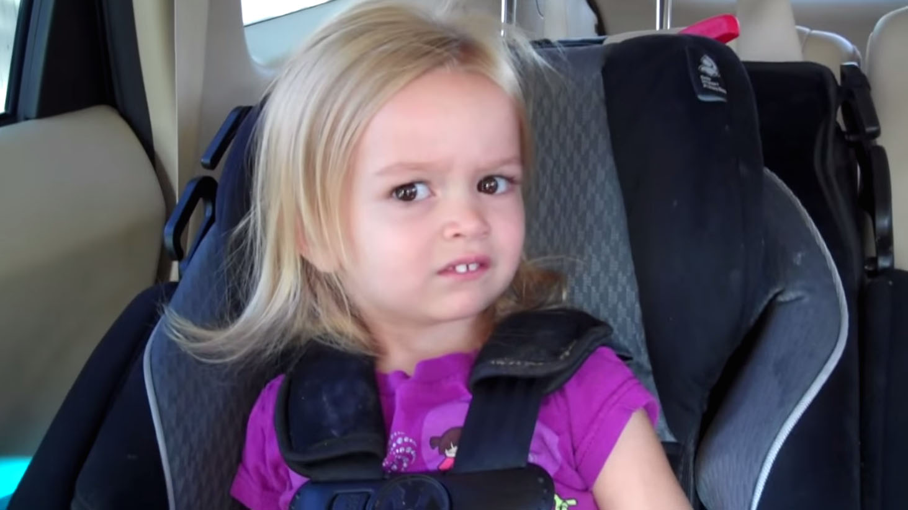
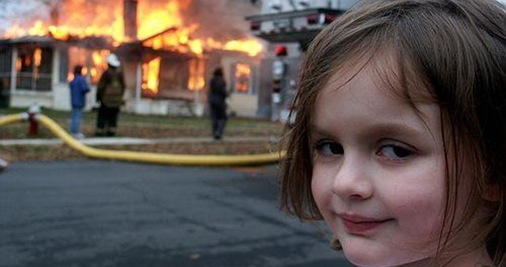
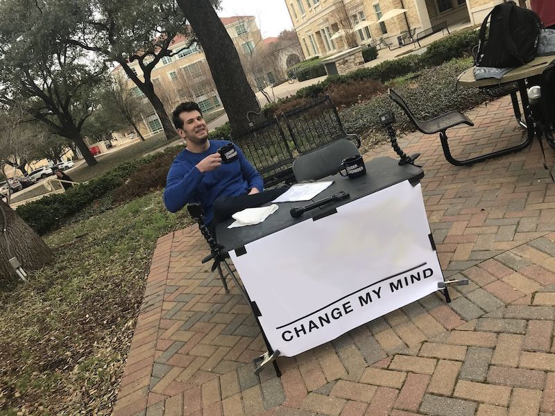

# Meme Inspirations — Wizards Reimagined

> **Status**: Exploration
> **Concept**: Classic internet memes reimagined with our wizard/scientist characters. These could serve as promotional material, loading screens, card flavor art, or community engagement content. Each entry pairs a meme with a wizard who fits its energy.

---

## 1. "This is Fine" — Lavoisier

**Original**: A dog sits calmly in a burning room, sipping coffee: "This is fine."

**Wizard Version**: **Antoine-Laurent Lavoisier** (Head Wizard, Fire / School of Combustion) sits serenely in his burning alchemical laboratory, quill still in hand, calmly writing notes. Flames engulf the bookshelves and apparatus around him. He glances up with a composed expression:

> *"This is fine. I can explain exactly what's happening here."*

**Why it works**: Lavoisier literally explained what fire *is*. He's the one person in the room who actually understands the combustion happening around him — so his calm isn't denial, it's expertise. The dark layer: historically, Lavoisier was executed during the French Revolution. He was calm at the end too.

**Alternate takes**:
- **Count Rumford** (Heat / School of Friction) — rubbing his hands together while everything burns: *"See? Heat IS motion."*
- **Sadi Carnot** (Head Wizard, Heat) — taking notes on the fire's efficiency: *"This is fine. But only 40% efficient."*

---

## 2. "Side Eyeing Chloe" — Lise Meitner

**Original**: A toddler gives a deeply skeptical side-eye, radiating doubt and quiet judgment.

**Wizard Version**: **Lise Meitner** (Radioactive / School of Fission) giving the ultimate side-eye as **Otto Hahn** accepts credit for nuclear fission — work she explained theoretically but was denied recognition for.

> *[silent, devastating side-eye]*

**Why it works**: Meitner is the patron saint of scientific skepticism and being right when others get the credit. She explained fission and was snubbed for the Nobel. That side-eye isn't just skepticism — it's *justified* skepticism.

**Alternate takes**:
- **Alfred Wegener** (Earth / School of Shifting Ground) — side-eyeing geologists who insist continents don't move: *"Sure. The fossils match on both sides of the Atlantic by coincidence."*
- **Ludwig Boltzmann** (Head Wizard, Ghost / School of Entropy) — side-eyeing physicists who reject the existence of atoms.
- **Gregor Mendel** (Plant / School of the Seed) — side-eyeing scientists who ignored his heredity papers for 35 years.

---

## 3. "Success Kid" — Archimedes

**Original**: A determined baby on a beach clenches his fist in triumph.

**Wizard Version**: **Archimedes of Syracuse** (Head Wizard, Water / School of Fluids) bursting from a bath, fist clenched, water splashing everywhere:

> *"EUREKA!"*

**Why it works**: This is literally one of the most famous moments of scientific triumph in history. Archimedes discovered buoyancy in the bath and ran through the streets naked shouting "Eureka!" The clenched fist of a baby on a beach mirrors a man rising from the water with a discovery. Pure triumph energy.

**Alternate takes**:
- **Marie Curie** (Head Wizard, Radioactive) — fist clenched, glowing vial in hand: *"Two elements. Two Nobels. No big deal."*
- **Michael Faraday** (Head Wizard, Electric) — fist clenched over a spinning motor: *"Electricity now does work."*
- **Henrietta Swan Leavitt** (Cosmic / School of the Light) — fist clenched: *"Measured the universe. From a photograph."*

---

## 4. "Disaster Girl" — Lise Meitner (or Marie Curie)

**Original**: A young girl smiles devilishly while a house burns behind her, implying she caused it.

**Wizard Version (Option A)**: **Lise Meitner** (Radioactive / School of Fission) smiling calmly as a nuclear chain reaction mushroom cloud rises behind her. She holds a chalkboard with fission equations:

> *"I just explained how to split the atom. What you do with it is your problem."*

**Wizard Version (Option B)**: **Marie Curie** (Head Wizard, Radioactive) smiling serenely as her entire laboratory glows an eerie blue-green behind her. Everything is irradiated — notebooks, instruments, her own hands:

> *"It glows. Isn't that wonderful?"*

**Why it works**: The Radioactive school has the most "disaster girl" energy in the game. Curie's notebooks are still radioactive over 100 years later — her legacy literally radiates destruction. Meitner explained the physics that made the atomic bomb possible. Both fit the meme's energy of calm satisfaction while chaos unfolds.

**Alternate takes**:
- **Carl Wilhelm Scheele** (Poison / School of Corrosion) — smiling in front of shelves of toxic compounds he synthesized: *"I discovered chlorine, cyanide, AND fluoride. Also I'm dying."*
- **Nikola Tesla** (Magnetic / School of the Field) — smiling as lightning arcs from his Tesla coil behind him.

---

## 5. "Change My Mind" — Alfred Wegener

**Original**: A man sits at a table with a sign displaying a bold claim and the challenge "Change My Mind."

**Wizard Version**: **Alfred Wegener** (Earth / School of Shifting Ground) sits at a table in a geology department, sign reading:

> *"The continents move. Change my mind."*

**Why it works**: Wegener proposed continental drift in 1912 and was ridiculed by the geological establishment for decades. He died on a Greenland expedition in 1930, still unvindicated. He wasn't proven right until the 1960s with plate tectonics. He *literally* challenged the scientific establishment to change his mind, and nobody could — they just refused to believe him.

**Alternate takes**:
- **Paracelsus** (Head Wizard, Poison) — *"The dose makes the poison. Change my mind."* (Nobody has, for 500 years.)
- **Boltzmann** (Head Wizard, Ghost) — *"Atoms are real. Change my mind."* (He was right. It broke him.)
- **Isaac Newton** (Head Wizard, Earth) — *"F = ma. Change my mind."* (Confident. Intimidating. Good luck.)
- **Archimedes** (Head Wizard, Water) — *"Everything displaces its own volume. Change my mind."* (Sitting in a bath.)

---

## Design Questions

- [ ] Should these be commissioned as actual game art (card flavor, loading screens)?
- [ ] Could these serve as "achievement" images for in-game milestones?
- [ ] Are there meme formats that map to other schools that don't have a natural fit yet?
- [ ] Should we create a "wizard meme generator" as a community/marketing tool?
- [ ] Do any of these pairings suggest card mechanics or flavor text?
